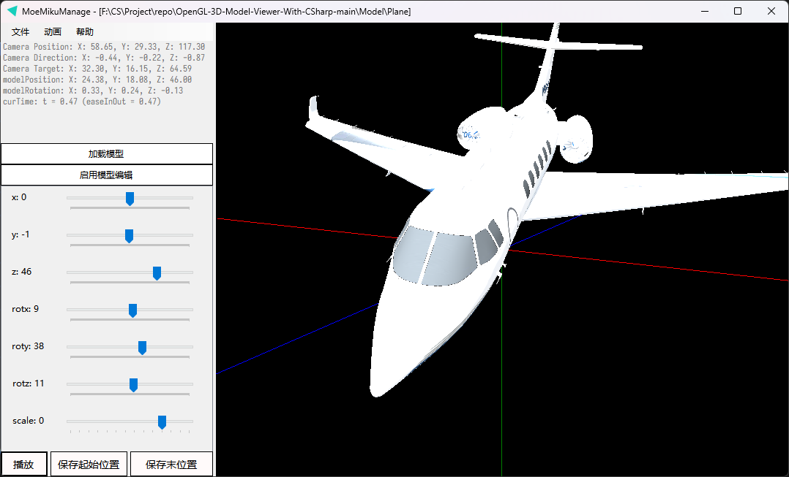
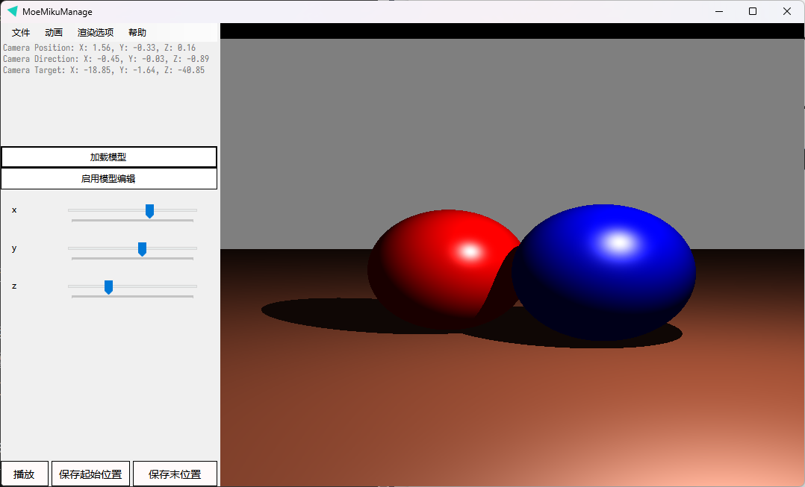

# MoeMikuManage

1）由Obj等格式文件读入模型并正确的进行真实感显示

2）对模型进行平移、旋转、放缩操作, 

3）对模型操作的交互自然性

1）正确定义起始和终止姿态并显示

2）能够平滑地由起始到终止位置的平移

3）能够由起始到终止位姿平滑旋转和平移

4）交互界面

1）能够正确显示出三维场景中的物体

2）程序效率

3）能够手动设置光源、观察位置对场景进行观察

